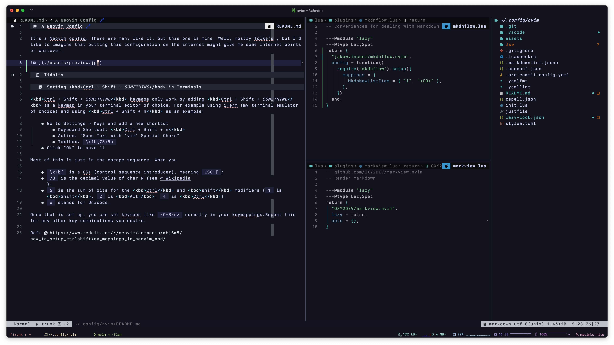

# A Neovim Config 💤

It's a Neovim config. There are many like it, but this one is mine.

It's deliberately not fancy anymore - it uses some LSP features, but mostly only for editing the `nvim` configuration itself, not for most of the programming that I do. I've had too many frustrations with Neovim in recent days that I really don't want to complicate it more than I have to. I use it for quick edits, and use VSCode to do the bulk of my "real" coding. Don't @ me.

Oh also I use iTerm because I think it has much better layout of tabs. I think that Ghostty's use of tabs to be a bit ugly, so I don't bother. Sue me.

## Tidbits

### Setting <kbd>Ctrl + Shift + _SOMETHING_</kbd> in Terminals

<kbd>Ctrl + Shift + _SOMETHING_</kbd> keymaps only work by adding <kbd>Ctrl + Shift + _SOMETHING_</kbd> as a keymap in your terminal editor of choice. For example using iTerm (my terminal emulator of choice) and using <kbd>Ctrl + Shift + n</kbd> as an example:

- Go to Settings > Keys and add a new shortcut
  - Keyboard Shortcut: <kbd>Ctrl + Shift + n</kbd>
  - Action: "Send Text with 'vim' Special Chars"
  - Textbox: `\x1b[78;5u`
- Click "OK" to save it

Most of this is just in the escape sequence. When you

- `\x1b[` is a CSI (control sequence introducer), meaning `ESC+[`;
- `78` is the decimal value of char N (see [Wikipedia](https://en.wikipedia.org/wiki/List_of_Unicode_characters));
- `5` is the sum of bits for the <kbd>Ctrl</kbd> and <kbd>shift</kbd> modifiers (`1` is <kbd>Shift</kbd>, `2` is <kbd>Alt</kbd>, `4` is <kbd>Ctrl</kbd>);
- `u` stands for Unicode.

Once that is set up, you can set keymaps like `<C-S-n>` normally in your keymappings.Repeat this for any other key combinations you desire.

Ref: <https://www.reddit.com/r/neovim/comments/mbj8m5/how_to_setup_ctrlshiftkey_mappings_in_neovim_and/>
